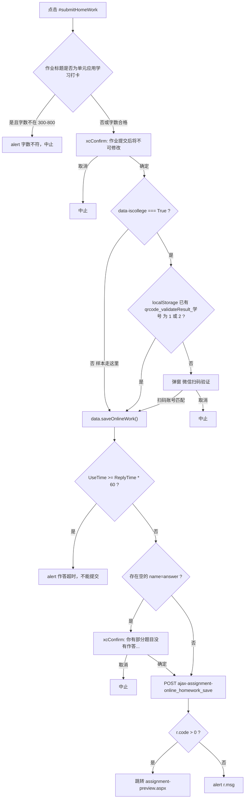

# 开大自动答题页面结构

本文只记录「在线作业预览/作答页」的 DOM、状态和脚本契约，供后续自动识别题量、题型、题干、选项和选中态使用。

- 证据来源：已打开的 Chrome 作业页现场 DOM + `previewnew.js` + `current_scroll.js` + `common/themes/default/index.css`

- 样本页：`https://l.shou.org.cn/study/assignment/preview.aspx`

- 样本作业在打开时共 60 题：单项 25、多项 15、判断 20。题量以页面实计为准，不要写死 60

- 本页 **没有** 原生 `input[type=radio]` / `input[type=checkbox]`，也 **没有** iframe。选项是可点击的 `li.e-a`

- 禁止写入学号、token、账号、姓名、完整题目库、生产配置全文

---

## 1. 入口 URL

路径：

```text
https://l.shou.org.cn/study/assignment/preview.aspx
```

查询参数（只记名字，不记具体值）：

| 参数 | 用途 |
| --- | --- |
| `homeWorkId` | 作业 ID，提交时对应 `WorkId` |
| `courseopenid` | 课程 ID，对应隐藏域 `CourseOpenId` |
| `minorCourseOpenId` | 辅修/子课程 ID |

浏览器标题形如：`- 课程学习 - 上海开放大学`。作业名在页顶 `h1.am-topbar-brand`，样本为「记分作业一」。

另有一条几乎同内容的旧地址 `/study/assignment-preview.aspx`（中间没有 `/`）。提交成功后脚本会跳到这条。自动化应同时认两条。

---

## 2. 整页骨架

```text
body
└─ .wrapper
   └─ .container
      ├─ .d-header
      │  └─ .am-topbar.am-topbar-inverse
      │     └─ h1.am-topbar-brand          作业名
      └─ .content
         ├─ .wl_types.am-cf[role=navigation]     顶部分类条 + 右侧答题卡（position:fixed）
         ├─ .left-all                            左侧题目正文
         │  └─ .e-q-panel.typebox[data-type] × N
         └─ .e-save
            └─ a#submitHomeWork.e-save-b         提交作业
```

相关样式表：

- `/common/themes/default/basic.css`
- `/common/themes/default/index.css`

相关脚本：

- `/study/js/assignment/previewnew.js`：点击选项、写 answer、逐题 POST、提交整份作业、倒计时
- `/study/js/assignment/current_scroll.js`：题型 Tab / 题号点击滚动、折叠题型面板

60 道题的 `.e-q-body` **一次全部在 DOM 里**，计算样式全是 `display:block`，不是翻页加载。

---

## 3. 页面级隐藏域

在 `.wl_types` 里，**每题 form 之外**还有一套全局 hidden（作答页打开时这些值由服务端填充，文档不记录具体值）：

| name | 用途 |
| --- | --- |
| `CourseOpenId` | 课程 |
| `ReplyTime` | 作答时限（分钟）。倒计时用 `ReplyTime * 60` 秒 |
| `homeworkTitle` | 作业标题。提交时对「单元应用学习打卡」有字数校验 |
| `UseTime` | 已用秒数，倒计时每秒更新 |
| `WorkId` | 作业 ID |
| `HomeWorkUniqueFlag` | 作业唯一标记，提交整份时带上 |
| `paperStructUniqueFlag` | 试卷结构唯一标记 |
| `minorCourseOpenId` | 子课程 |

每题 form 内再各有一套：

| name | 何时写入 |
| --- | --- |
| `HomeWorkUniqueFlag` | 服务端预填或空 |
| `studentWorkId` | 学生作答记录，可能空 |
| `answer` | **当前题答案，自动化的权威字段** |
| `timestamp` | 点击选项时写成 `Date.getTime()` |
| `online` | 在线标记 |

样本打开时 60 个 `answer` 全为空。

---

## 4. 顶部分类条 `.wl_types`

```html
<div class="wl_types am-cf" role="navigation">
  <!-- 全局 hidden 见上 -->
  <div class="e-b-g types-l">
    <a href="#题型面板header的id" title="单项选择题" class="e-b go_type q_type active" data-type="1">单项选择题</a>
    <a href="#..." title="多项选择题" class="e-b go_type q_type" data-type="2">多项选择题</a>
    <a href="#..." title="判断题" class="e-b go_type q_type" data-type="3">判断题</a>
  </div>
  <div class="e-quest-p w_e-q-panel" id="review" style="position:fixed; top:88px;">
    ...右侧答题卡...
  </div>
</div>
```

| 选择器 | 含义 |
| --- | --- |
| `a.go_type[data-type]` | 题型 Tab |
| `data-type="1"` | 单项选择题 |
| `data-type="2"` | 多项选择题 |
| `data-type="3"` | 判断题 |
| `a.go_type.active` | 当前滚动位置所在题型。绿底 `#5d9417`，白字 |
| `a.go_type:not(.active)` | 未激活。灰字 `#737373`，透明底 |

`current_scroll.js`：点击 `a.go_type` 会滚到 `.typebox[data-type=...]`。窗口滚动时根据各 `.typebox` 的 `offset().top` 给对应 Tab 加/去掉 `active`。

**不要用 Tab 的 `active` 统计题量。** 题量看 `.e-q-body` 或左侧 `a.e-item`。

---

## 5. 右侧答题卡

容器：`#review.e-quest-p.w_e-q-panel`，`position:fixed; top:88px`。

### 5.1 倒计时

```html
<div class="photo">
  <div class="photo-time">
    <p class="icon-photo">HH:MM:SS</p>
  </div>
</div>
```

脚本 `data.initDownTime() / data.solveTime()` 每秒改 `.photo .icon-photo` 文本，并把已用秒写入 `[name=UseTime]`。超时后 `saveOnlineWork` 会拒绝提交（`UseTime >= ReplyTime * 60`）。

### 5.2 图例

```html
<div class="e-quest-header">
  <span class="right">已做<em></em></span>
  <span class="not">未做<em style="background-color: #EAEAEA"></em></span>
</div>
```

CSS 里 `.right em` 默认 `#01b59c`（`rgb(1, 181, 156)`），`.not em` 默认 `#3d3e45`；样本页未做色块被 inline 写成 `#EAEAEA`，和题号默认灰底一致。

注意：图例「已做」色块是 `#01b59c`，题号格子提亮实际是 `#099` / `rgb(0, 153, 153)`。两色接近但不是同一个值。认题号提亮用 `#099` 或 class `active`。

### 5.3 题号网格

```html
<div class="e-selects-g">
  <div class="e-single-s question_nums">
    <div class="e-select-i">单项选择题<span class="e-i-desc"></span></div>
    <div class="e-select-g">
      <a href="#题目data-id" data-id="题目data-id" class="e-item notdo" data-num="1"
         role="checkbox" aria-checked="false" aria-describedby="title">1</a>
      ...
    </div>
  </div>
  <!-- 多项、判断各一组 question_nums -->
</div>
```

样本分组：

| 组标题 | data-num |
| --- | --- |
| 单项选择题 | 1–25 |
| 多项选择题 | 26–40 |
| 判断题 | 41–60 |

每个题号 `<a.e-item>`：

| 属性 | 含义 |
| --- | --- |
| `data-num` | 题号，对应 `.e-q-body[data-num]` |
| `data-id` | 题目 ID，对应 `.e-q-body[data-id]` 和 `href="#该id"` |
| `class=notdo` | 服务端渲染的「未做」标记。CSS **没有**单独的 `.notdo` 规则 |
| `class=active` | 保存成功后的「已做提亮」（截图红框里 1、2 那种青底白字）。`isDoWork()` 在该题 `[name=answer]` 有值时加上。**不是**「当前正在看哪题」 |
| `aria-checked` | 已做时 `"true"`，未做 `"false"`，和 `active` 一起改 |
| `role="checkbox"` | 无障碍残留，不是原生复选框 |

默认样式（未做）：灰底 `#eaeaea`，绿字 `#5d9417`，约 19.6×19px。

### 5.3.1 选中后右侧题号提亮

截图红框里的 1、2 就是这种状态：左侧选项打勾之后，右侧对应数字从灰底绿字变成青底白字，而且会一直亮着。再答第 2 题时，第 1 题不会熄灭，1 和 2 同时提亮。

现场（CDP 实读，用户已选第 1、2 题 A）：

| 题号 | 左侧选项 | 右侧 class | 背景 | 文字 | aria-checked | `[name=answer]` |
| --- | --- | --- | --- | --- | --- | --- |
| 1 | A 打勾，`li.e-a.checked` | `e-item notdo active` | `rgb(0, 153, 153)` / `#099` | `#fff` 白 | `"true"` | `"0"` |
| 2 | 同上 | 同上 | 同上 | 同上 | `"true"` | `"0"` |
| 3 及以后 | 无勾 | `e-item notdo` | `rgb(234, 234, 234)` / `#eaeaea` | `rgb(93, 148, 23)` / `#5d9417` 绿 | `"false"` | `""` |

全页 60 个格子都还带着 `notdo`；带 `active` 的只有 1、2。所以 **不要用 `notdo` 判断已做**。

格子本身（已做 / 未做相同）：`display:inline-block`，宽约 19.6px，高 19px，字 14px / 行高 19px，居中，`box-shadow: rgb(210, 210, 210) 0px 1px 1px`，无圆角。变的只是背景和字色。

出现时机（单项/判断，本样本 1、2 题都是 type=1）：

1. 点左侧 `li.e-a`
2. 脚本立刻写该题 `[name=answer]`、`[name=timestamp]`，`POST /study/ajax-assignment-online_homework_answer`
3. **成功回调才同时**：当前 `li` 加 `checked`（左侧勾图）；`data.isDoWork()` 给右侧 `a.e-item[data-num=该题号]` 加 `active` 并把 `aria-checked` 设成 `"true"`
4. 失败则去掉 `checked`，题号不会提亮

多选题不同：点下去立刻 `toggleClass("checked")`，提亮仍要等保存成功后的 `isDoWork()`。

`isDoWork()` / `updateDoWork()` 规则：该题 `[name=answer]` 有值 → `addClass("active").attr("aria-checked","true")`；空 → 去掉 `active`，`aria-checked="false"`。页面加载时 **不会** 调 `updateDoWork()`。

| 状态 | class | 背景 | 文字 | aria-checked | 样本 |
| --- | --- | --- | --- | --- | --- |
| 未做 | `e-item notdo` | `#eaeaea` / `rgb(234, 234, 234)` | `#5d9417` 绿 | `"false"` | 题号 3 及以后 |
| 已做（提亮） | `e-item notdo active` | `#099` / `rgb(0, 153, 153)` | `#fff` 白 | `"true"` | 作答后的题号 1、2 |
| 鼠标悬停 | 走同一套 `active` CSS | `#099` | `#fff` | 不变 | 未做题 hover 也会暂时提亮，松手回到灰底 |

```css
.e-selects-g .e-select-g .e-item { background-color: #eaeaea; }
.e-selects-g .e-select-g .e-item:hover,
.e-selects-g .e-select-g .e-item.active { background-color: #099; color: #fff; }
```


样式表里还有批改态（**本作答页现场没有**，不要和工作中的提亮搞混）：

| class | 用途 | 颜色 |
| --- | --- | --- |
| `.active` | 作答中的已做提亮 | `#099` / `rgb(0, 153, 153)` 青底白字 |
| `.right` | 批改后答对 | `#01b59c` / `rgb(1, 181, 156)` |
| `.wrong` | 批改后答错 | `rgb(236, 54, 0)` |
| `.not` | 批改后仍未做 | `rgb(61, 62, 69)` |

图例「已做」色块用的是 `.right em` 的 `#01b59c`，和题号提亮 `#099` **不是同一个值**。认提亮用 class `active` 或背景 `#099`。

`current_scroll.js` 给顶部题型 Tab `a.go_type` 加 `active`，**不会**给题号格子加 `active`。现场已作答后，题号 `active` 与非空 `answer` 一一对应。首屏未点选项时第 1 题会不会自带 `active`：当前页已作答，无法回看，**信息不全，待人工补充**。

采集右侧已提亮题号：

```js
[...document.querySelectorAll(".e-selects-g a.e-item.active")].map(a => a.dataset.num)
```

判定：

| 判定 | 不可靠 | 可靠 |
| --- | --- | --- |
| 当前正在看哪题 | 题号 `active`（那是已做） | 视口里的 `.e-q-body` / 最近点击的 `data-num` |
| 用户可见已做（右侧提亮） | `notdo`（作答后还在）；hover 也会暂时变青 | `a.e-item.active` 且背景 `#099` |
| 是否真正保存 | 只看 `checked` 或只看 `active`；只读 Playwright evaluate 可能把已有 `input.value` 读成空 | **页面真实 `form [name=answer].value` 非空**（用 CDP / 页面脚本读）。读不到值时用 `active` + `li.checked` 交叉验证 |
| 未做数量 | `.notdo` 个数 | 没有 `active` 的题号，或 `answer` 为空 |

点击题号：`current_scroll.js` 用 `.e-q-body[data-num=...]` 定位并滚动。若题型面板有 `closed`，先点 `.e-close` 展开再滚。

### 5.4 提交按钮（外观）

```html
<div class="e-save">
  <a href="javascript:;" class="e-save-b" data-userid="（学号，禁止采集）"
     data-iscollege="False" id="submitHomeWork">提交作业</a>
</div>
```

绿底 `#5d9417`，白字，约 233×40，固定在右侧答题卡底部。完整点击链路见第 13 节，不要只点按钮不处理弹窗。

---

## 6. 题目怎么数、题型怎么分

推荐采集：

```js
const bodies = [...document.querySelectorAll(".e-q-body")];
const total = bodies.length;
const byType = {
  1: bodies.filter(el => String(el.dataset.questiontype) === "1"), // 单选
  2: bodies.filter(el => String(el.dataset.questiontype) === "2"), // 多选
  3: bodies.filter(el => String(el.dataset.questiontype) === "3"), // 判断
};
```

| 字段 | 选择器 |
| --- | --- |
| 总题数 | `.e-q-body` 或 `.e-selects-g a.e-item`，两者应相等 |
| 单选数 | `.typebox[data-type="1"] .e-q-body` 或 `[data-questiontype="1"]` |
| 多选数 | `.typebox[data-type="2"] .e-q-body` |
| 判断数 | `.typebox[data-type="3"] .e-q-body` |
| 已做数 | `.e-q-body` 中 `form [name=answer]` 有值的数量 |
| 未做数 | `answer` 为空的数量 |

样本实计：总 60，type1=25，type2=15，type3=20。

---

## 7. 题型面板 `.typebox`

```html
<div class="e-q-panel typebox" data-type="1">
  <div class="e-q-header am-cf" id="...">
    <span class="e-text">一、单项选择题</span>
    <span class="e-close">&nbsp;</span>
  </div>
  <div class="ErichText" style="display:none">答题要求 : 无</div>
  <div class="e-q-body" data-questiontype="1" data-id="..." data-num="1">...</div>
  ...
</div>
```

| data-type | 面板标题（样本） |
| --- | --- |
| 1 | 一、单项选择题 |
| 2 | 二、多项选择题 |
| 3 | 三、判断题 |

点 `.e-q-header` 会给面板加/去掉 `closed`，并对 `.e-q-body` 做 `slideUp/slideDown`。折叠后题目仍在 DOM 里。

`a.go_type[href]` 指向对应 `.e-q-header[id]`。

---

## 8. 单题容器 `.e-q-body`

每题一块，id 等于 `data-id`：

| 属性 | 含义 |
| --- | --- |
| `id` / `data-id` | 题目唯一 ID（短码，不是学号） |
| `data-num` | 显示题号，从 1 起跨题型连续编号 |
| `data-questiontype` | `1` 单选 `2` 多选 `3` 判断 |
| 内部 `form` | `method="post"` `action="/study/ajax-assignment-online_homework_answer"` |

通用 DOM：

```html
<div id="{data-id}" class="e-q-body" data-questiontype="{1|2|3}" data-id="{data-id}" data-num="{n}">
  <form method="post" action="/study/ajax-assignment-online_homework_answer">
    <input type="hidden" name="HomeWorkUniqueFlag">
    <input type="hidden" name="studentWorkId">
    <input type="hidden" name="answer">
    <input type="hidden" name="timestamp">
    <input type="hidden" name="online">
    <div class="e-q">          <!-- 判断题这里是 e-q e-checking-q -->
      <div class="e-q-t">
        <div class="e-q-l"><div></div></div>
        <div class="e-q-r">
          <span class="e-q-no">{题号}<em>({分值}分)</em></span>
          <div class="e-q-quest">
            <div class="e-q-q"> ...题干... </div>
            <div class="e-a-g ..."> ...选项 ul>li... </div>
          </div>
        </div>
      </div>
    </div>
  </form>
</div>
```

题号与分值：

- 可见题号：`.e-q-no` 文本节点，如 `1`
- 分值：`.e-q-no em`，单选/多选样本 `(2分)`，判断样本 `(1分)`

题干：

- 选择器：`.e-q-q .ErichText pre`（有时是富文本其它标签）
- 选项文本在 `li .ErichText xmp` 或判断题 `li` 直出文本
- 注释写明：`<!-- P标签是富文本编辑器产生，不属于模板的一部分 -->`
- 取题干时只要 `.e-q-q`，不要把下面选项并进去

---

三类题现场对照（本样本）：

| | 单选 type=1 | 多选 type=2 | 判断 type=3 |
| --- | --- | --- | --- |
| 题量 | 25 | 15 | 20 |
| 题号 | 1–25 | 26–40 | 41–60 |
| 分值 | (2分) | (2分) | (1分) |
| 每题选项数 | 4（A–D） | 5（A–E） | 2（正确/错误） |
| 选项容器 | e-choice-a | e-choice-a | e-checking-a |
| 选项文本 | li 内 xmp | li 内 xmp | li 直出，无 xmp |
| A 的 data-index | 0 | 0 | 1（正确） |
| B 的 data-index | 1 | 1 | 0（错误） |
| 同时勾几个 | 只能 1 个 | 必须可多选 | 只能 1 个 |
| answer | 单个 index 字符串 | 逗号串，如 0,2,4 | 1=正确，0=错误 |
| 何时出勾 | 保存成功 | 立刻 toggle | 保存成功 |
| 清兄弟勾 | 会 | 不会，再点自己取消 | 会 |
| role | 都是假 radio，认题型只看 data-questiontype | 同左 | 同左 |

## 9. 单项选择题（type=1）

- 面板：`.typebox[data-type="1"]`
- 题目：`.e-q-body[data-questiontype="1"]`
- 选项容器：`div.e-a-g.e-choice-a > ul > li.e-a`
- 选项 `role="radio"`，`aria-checked` 样本上常为 `"false"`，**即使已加 `checked` 类也可能仍是 false**

选项：

```html
<li class="e-a" data-index="0" role="radio" aria-checked="false">
  <span class="e-a-right"></span>A)
  <div class="ErichText"><xmp>选项文本</xmp></div>
</li>
```

| data-index | 字母（本页） |
| --- | --- |
| 0 | A) |
| 1 | B) |
| 2 | C) |
| 3 | D) |

样本每题 4 项。不要写死 4，以 `li.e-a` 实计为准。

点击逻辑（`previewnew.js`）：

1. 若 `li` 有 `no-click`，弹「选择答案单击即可...」并 return
2. 同 `ul` 内所有 `li` 加上 `no-click` 防连点
3. `[name=answer].val(li.data("index"))`，例如 `"0"`
4. 写 `timestamp`
5. `form.submit()` → POST `/study/ajax-assignment-online_homework_answer`
6. 成功回调才给当前 `li` 加 `checked`，去掉兄弟 `checked`，并 `isDoWork()`

现场：25 题全是 4 选项；题干在 `.e-q-q .ErichText pre/xmp`；选项字母在 `li` 文本里，选项正文在 `li .ErichText xmp`。

未选：`li.e-a`，`.e-a-right` 无背景图，`aria-checked` 仍是 `"false"`。
已选（保存成功后）：`li.e-a.checked`，`.e-a-right` 出现 `input_right.png` 26×25 勾；同题只能一个 `checked`。换选项会 POST 新 index，成功后旧勾消失。

右侧题号：保存成功后对应格子加 `active` 青底白字。点太快会全组 `no-click`，弹「选择答案单击即可，不用重复点击，请等待系统响应...」。

自动化：点目标 `li.e-a[data-index]`；等该题 `[name=answer]` 变成该 index（字符串，如 `"0"` 表示 A）；再看右侧题号提亮。不要自己改 class。不要用 `aria-checked`。

---

## 10. 多项选择题（type=2）

- 面板：`.typebox[data-type="2"]`
- 题目：`.e-q-body[data-questiontype="2"]`
- 选项容器同样是 `div.e-a-g.e-choice-a > ul > li.e-a`
- 样本每题 5 项 A–E，`data-index` 0–4
- 样本 15 题全是 5 选项，分值 `(2分)`。题干同样在 `.e-q-q .ErichText pre/xmp`
- **`role` 仍是 `"radio"`**，不能靠 role 区分单选/多选。必须看 `data-questiontype`

点击逻辑：

**必须多选**：点一个选项不会清掉其他已选项。这是和单选/判断最大的差别。

1. 点某个 `li.e-a` → 立刻 `toggleClass("checked")`（已勾再点会取消）
2. 收集该题 `form li.checked` 的全部 `data-index`，逗号拼接写入 `[name=answer]`
3. 例：勾 A、C、E → `"0,2,4"`；只勾 B → `"1"`；全取消 → `""`
4. 写 `timestamp` 后立刻 POST 这一题（每点一次就保存一次当前集合）
5. 成功回调只调 `isDoWork()`：answer 非空则右侧题号提亮；被清空则熄灭。**不会**去掉其他选项的 `checked`

顺序是 DOM 里 `li.checked` 的遍历顺序，一般即 index 升序，但以页面拼接结果为准。

和单选的差别：

| | 单选 type=1 | 多选 type=2 |
| --- | --- | --- |
| 同时勾几个 | 只能 1 个，成功回调会清兄弟 | 可以多个，互不清 |
| 再点已选项 | 再 POST 同一 index | 取消该项，answer 去掉该 index |
| 点下去何时出勾 | 等保存成功 | 立刻 toggle；失败回调会清掉该题全部 checked |
| 全组 `no-click` | 有，防连点 | 普通多选（type=2）不加 |

自动化：对需要的每个 `data-index` 各点一次；点完后检查 `answer` 含全部目标 index，且对应 `li` 都有 `checked`。不要套单选「点一个清其他」。不要只点一个选项就算做完。

---

## 11. 判断题（type=3）

- 面板：`.typebox[data-type="3"]`
- 题目：`.e-q-body[data-questiontype="3"]`
- 外层：`div.e-q.e-checking-q`（样本上这个 div 的 `id="2"` **会重复**，不要当唯一键）
- 选项容器：`div.e-a-g.e-checking-a.am-cf > ul > li.e-a`
- 选项没有 `aria-checked`，有 `style="cursor:pointer"`
- 选项文本直接写在 `li` 里，没有 `xmp`

```html
<li class="e-a" data-index="1" role="radio" style="cursor:pointer">
  <span class="e-a-right"></span>A) 正确
</li>
<li class="e-a" data-index="0" role="radio" style="cursor:pointer">
  <span class="e-a-right"></span>B) 错误
</li>
```

**index 与字母反转（硬坑）：**

| 可见 | data-index | 写入 answer |
| --- | --- | --- |
| A) 正确 | `1` | `"1"` |
| B) 错误 | `0` | `"0"` |

点击逻辑与单选相同：`answer = data-index`，互斥 `checked`，然后 POST。

不要用「A=0、B=1」去套判断题。

现场：20 题全部都是这两项，分值 `(1分)`。题干在 `.e-q-q .ErichText pre`；选项正文不在 `xmp` 里，直接是 `A) 正确` / `B) 错误`。

选项容器是 `div.e-a-g.e-checking-a.am-cf`，不是单选/多选的 `e-choice-a`。勾选图 CSS 走 `.e-checking-a .e-a.checked .e-a-right`，图仍是 `input_right.png`。

没有 `aria-checked` 属性（不是 false，是没有）。`role` 仍是 `"radio"`。`li` 带 `style="cursor:pointer"`。

点击走**单选同一个 handler**（type=1 和 type=3 绑在一起）：

1. 全组加 `no-click`
2. `answer = data-index`，正确写 `"1"`，错误写 `"0"`
3. POST 同一接口
4. 成功后当前 `li` 加 `checked`，去掉兄弟，`isDoWork()` 提亮右侧题号

不要点文字「正确/错误」去猜 index；点 `li.e-a[data-index="1"]` 或 `[data-index="0"]`。不要写成 true/false、A/B、对/错。

外层 `div.e-q.e-checking-q id="2"` 在 20 道判断题上**全部重复**。定位用 `.e-q-body[data-num]` 或 `data-id`，不要用这个 `id=2`。

---

## 12. 选中态 / 未选中态

视觉由 CSS 控制：

```css
.e-checking-a .e-a.checked .e-a-right,
.e-choice-a .e-a.checked .e-a-right {
  width: 26px;
  height: 25px;
  position: absolute;
  top: 3px;
  left: 0;
  background: url(/common/themes/default/images/input_right.png) no-repeat;
}
```

| 状态 | 选项 `li` | 选项勾 `.e-a-right` | 右侧题号 | `form [name=answer]` |
| --- | --- | --- | --- | --- |
| 未选 / 未做 | `e-a` | 无背景图 | `e-item notdo` 灰底绿字 | 空，或不含该 index |
| 已选 / 已做 | `e-a checked` | `input_right.png` 26×25 | `e-item notdo active` 青底 `#099` 白字 | 单选/判断等于 `data-index`；多选为逗号串 |

优先级（从高到低）：

1. **`input[name=answer]` 的值**（是否已做、当前答案）
2. `li.e-a.checked`（成功回调后的 UI）
3. `.e-a-right` 是否出现勾选图（纯视觉）
4. 不要用 `aria-checked`（选项上经常全是 false）
5. 不要只用题号 `notdo`（作答后还在）
6. 右侧提亮（`a.e-item.active` + 背景 `#099`）是用户可见的已做，可与 `answer` 交叉验证

### 12.1 已验证的假阳性

样本页第 1 题 A（`data-index="0"`）在 **从未写入 answer** 时就已经是 `li.e-a.checked`，`e-a-right` 也有勾选图；同时：

- `form [name=answer]` 仍为空
- 左侧题号仍是 `e-item notdo active`（这里的 active 只表示当前题）
- 该 `li` 的 `aria-checked="false"`

所以：**不能一见到 `checked` 就当作用户已作答。** 必须以 `answer` 隐藏域为准。

本轮复核（CDP）：用户已点第 1、2 题 A 后，两题 `[name=answer].value` 实际是 `"0"`，右侧 1、2 为 `e-item notdo active` 青底白字，与保存成功后状态一致。只读 Playwright evaluate 会把这两个已有 value 读成空字符串，不能当证据。第 12.1 节的「作答前首屏假阳性」当前无法回看，**信息不全，待人工补充**（需在未点任何选项前用 CDP 再验）。`checked` 仍只是 UI：多选题会在 POST 成功前就 `toggleClass("checked")`。

---

## 13. 逐题保存与整份提交

两套接口，不要混：

| 动作 | 触发 | 接口 | 结果 |
| --- | --- | --- | --- |
| 保存一题 | 点 `li.e-a` | `POST /study/ajax-assignment-online_homework_answer` | 该题 `answer` 有值；右侧题号加 `active` 提亮 |
| 提交整份 | 点 `#submitHomeWork` 并过弹窗 | `POST /study/ajax-assignment-online_homework_save` | 作业锁定，跳预览页 |

`head` 上 `data-vp2="/study/"`，完整 URL 为 `https://l.shou.org.cn` + vp2 + 接口名。

### 13.1 点选项 = 立刻保存一题

改 DOM class **不会**算作答。必须触发 `li` 的 click，让页面自己：

1. 写 `answer` / `timestamp`
2. `POST /study/ajax-assignment-online_homework_answer`（该题 `form` 的 action）
3. 成功回调才给当前 `li` 加 `checked`，并 `isDoWork()` 让右侧题号提亮


失败：去掉 `checked`（多选会清掉该题全部勾），alert「网络异常，请重新作答!」或 `r.msg`。

连点：单选/判断会给全组加 `no-click`，提示「选择答案单击即可...」；普通多选 type=2 不加全组锁，但失败会提示「您当前的网络不稳定，请重试」。

单选/判断：勾出现在保存成功后，且互斥。多选：一点就 toggle，可同时多个勾，每点一次 POST 当前全集。

保存成功后右侧对应 `a.e-item[data-num]` 变为 `active`，青底 `#099` 白字，`aria-checked="true"`。`notdo` 仍在。

### 13.2 提交整份作业（自动提交必须走完这条链）

样本页按钮：

```html
<a href="javascript:;" class="e-save-b" data-userid="（禁止采集）"
   data-iscollege="False" id="submitHomeWork">提交作业</a>
```

| 属性 | 用途 |
| --- | --- |
| `id="submitHomeWork"` | 点击入口 |
| `data-iscollege` | 样本为 `"False"`。**只有 `"True"`（行业分校）才弹微信二维码** |
| `data-userid` | 脚本用 `userId.substr(4)` 得到学号去对二维码账号。**禁止写入项目文档和日志** |

`confirm` 不是浏览器原生 `window.confirm`。`utils.js` 把它换成 `window.wxc.xcConfirm`，按钮是：

- 确定：`a.sgBtn.ok`，文本「确定」
- 取消：`a.sgBtn.cancel`，文本「取消」

点确定才继续；点取消中止。

### 13.2.1 二次确认弹窗（截图那张）

点 `#submitHomeWork` **不会立刻提交**。页面中央弹出白框，背后灰色遮罩。这不是浏览器原生 confirm，Playwright 的 dialog 事件接不到，必须点页面上的按钮。

第一次确认（样本已验证，截图）：标题「提示」；黄圆问号；正文「作业提交后将不可修改，您确定要提交作业吗？」；右上角 ×。

```html
<div class="xcConfirm" id="pop_时间戳随机数">
  <div class="xc_layer"></div>
  <div class="popBox">
    <div class="ttBox"><a class="clsBtn"></a><span class="tt">提示</span></div>
    <div class="txtBox">
      <div class="bigIcon" style="background-position:-48px 0;"></div>
      <p>作业提交后将不可修改，您确定要提交作业吗？</p>
    </div>
    <div class="btnArea"><div class="btnGroup">
      <a class="sgBtn ok">确定</a>
      <a class="sgBtn cancel">取消</a>
    </div></div>
  </div>
</div>
```

| 按钮 | 选择器 | 文本 | 颜色 | 作用 |
| --- | --- | --- | --- | --- |
| 确定 | `a.sgBtn.ok` | 确定 | `#36367a` 深蓝 | 继续提交 |
| 取消 | `a.sgBtn.cancel` | 取消 | `#5d9417` 绿 | 不提交 |
| × | `a.clsBtn` | 无 | 图标 | 等同取消 |

**绿的是取消，深蓝才是确定。** 不要按颜色猜。

点确定后：样本非行业分校直接 saveOnlineWork()。若还有空 answer，再弹一次同样结构，正文换成「你有部分题目没有作答,未作答的题目被视为错误，您确定要提交作业吗？」，再点一次确定才 POST 整份。点取消/×则关掉，作业还在。回车也会触发确定。

现场实走过一遍（未锁卷）：

1. 点 `#submitHomeWork` → 第一次弹窗，正文「作业提交后将不可修改，您确定要提交作业吗？」
2. 点深蓝 `a.sgBtn.ok` → 第一次关掉；样本无二维码；因为还有空题，立刻弹出第二次，正文「你有部分题目没有作答,未作答的题目被视为错误，您确定要提交作业吗？」（「作答」后面是英文逗号）
3. 两次弹窗 DOM 一样：标题「提示」、黄问号、深蓝确定、绿色取消。当时已做 2 题、未做 58 题。页面仍停在 `preview.aspx`，**还没有 POST 整份**
4. 点绿色取消 → 弹窗消失，作业还能改。若在第二次再点确定，才会 `POST ajax-assignment-online_homework_save`，提交后不可再改

第一次弹窗实测：白框 570×252，遮罩 `rgb(102,102,102)` / 0.5；确定 `rgb(54, 54, 122)`，取消 `rgb(93, 148, 23)`，都是 95×35 白字。



### 13.3 提交前脚本还会读的字段

| 来源 | 字段 | 用途 |
| --- | --- | --- |
| `[name=homeworkTitle]` | 标题 | 三个「单元应用学习打卡」要校验 `[name=StudentAnswer]` 300–800 字 |
| `[name=UseTime]` | 已用秒 | 倒计时写入；`>= ReplyTime*60` 则禁止提交 |
| `[name=ReplyTime]` | 时限（分钟） | 换成秒再比 |
| `[name=HomeWorkUniqueFlag]` | 作业标记 | POST body |
| `[name=paperStructUniqueFlag]` | 试卷结构 | POST body |
| `[name=WorkId]` | 作业 ID | POST body，也是跳转 `homeWorkId` |
| `[name=minorCourseOpenId]` | 子课程 | POST body |
| `[name=CourseOpenId]` | 课程 | 成功跳转用 |
| 每题 `[name=answer]` | 答案 | 任一为空则第二次确认 |

最终 POST（`dataType: json`）：

```text
POST https://l.shou.org.cn/study/ajax-assignment-online_homework_save
useTime
homeWorkUniqueFlag
workId
paperStructUniqueFlag
minorCourseOpenId
```

成功：`alert(r.msg)`，然后

```text
/study/assignment-preview.aspx?homeWorkId={workId}&courseopenid={CourseOpenId}&minorCourseOpenId={minorCourseOpenId}
```

提交后不可再改。

### 13.4 行业分校二维码（样本页可跳过）

仅当 `#submitHomeWork` 的 `data-iscollege="True"`：

1. `GET https://mapi.shou.org.cn/apis/v1/user/qrlogin/getqr`
2. 弹窗 `#dl_qrCodeCheck`，标题「微信扫码验证」，`#qrCode` 画码，`#qrcodeMessage` 默认「未扫码」
3. 轮询 `GET .../qrlogin/checkqr?id={qrCode.id}`
   - `10000` 未扫码，继续轮询
   - `10002` 同意授权后，用返回 token 调 `GET .../user/uc/userno`，`userno` 必须等于脚本算出的学号
   - 匹配则 `localStorage qrcode_validateResult_{学号} = 1`（2 小时），关弹窗
   - 脚本注释写了 `todo save homework`，**扫码成功当次不一定立刻 saveOnlineWork**；缓存命中后需再点一次提交
   - `10004` 过期则刷新二维码
4. 按钮只有「取消」

样本 `data-iscollege="False"`，`showQRCodeDialog` 开头直接 `saveOnlineWork()`，**不弹码**。

`data.checkValidateStatus()` 里刷脸校验已被注释，当前恒返回 `true`。

`bindModulesDialog`（学号+滑块「确认是本人」）相关 `ajax-Assignment-inputStuNo` 在提交函数里同样被注释，当前不走。

### 13.5 自动提交时要点哪里

1. 先确认未做数为 0，或接受「未作答视为错误」第二次确认
2. 点 `#submitHomeWork`
3. 等弹窗「作业提交后将不可修改...」，点深蓝 `a.sgBtn.ok`（确定）。**不要点绿色取消**
4. 若出现「微信扫码验证」弹窗：样本非行业分校不应出现；若出现则需用户扫码，禁止伪造 token
5. 若再出「你有部分题目没有作答...」，再点一次 `a.sgBtn.ok`
6. 等 `alert(r.msg)` 和跳转到 `assignment-preview.aspx`
7. 不要自己拼 POST 绕过页面，除非用户明确要求且能处理登录态

---

## 14. 推荐采集对象（每题一条）

```json
{
  "num": 1,
  "id": ".e-q-body 的 data-id",
  "type": 1,
  "typeName": "单项选择题",
  "scoreText": "(2分)",
  "stem": ".e-q-q 纯文本",
  "options": [
    { "index": "0", "letter": "A", "text": "...", "selectedUi": false }
  ],
  "answerValue": "",
  "done": false,
  "navHighlight": false
}
```

- `type`：`Number(el.dataset.questiontype)`
- `letter`：从 `li` 文本匹配 `^([A-Z])\)`，判断题同样 A/B，但 index 反转
- `selectedUi`：`li.classList.contains("checked")`，仅供对照
- `answerValue`：`form [name=answer].value`
- `done`：`Boolean(answerValue)`（权威）
- `navHighlight`：右侧 `a.e-item[data-num]` 是否带 `active`（用户看见的提亮）。应与 `done` 一致；不一致时以 `answerValue` 为准

汇总：

```json
{
  "total": 60,
  "single": 25,
  "multiple": 15,
  "judge": 20,
  "done": 0,
  "undone": 60
}
```

---

## 15. 选择器速查

| 目的 | 选择器 |
| --- | --- |
| 作业名 | `h1.am-topbar-brand` |
| 题型 Tab | `a.go_type[data-type]` |
| 题型面板 | `.typebox[data-type]` |
| 所有题 | `.e-q-body` |
| 某题 | `.e-q-body[data-num="N"]` 或 `[data-id="..."]` |
| 题号 | `.e-q-no` |
| 分值 | `.e-q-no em` |
| 题干 | `.e-q-body[data-num="N"] .e-q-q` |
| 单选/多选选项 | `.e-q-body[data-questiontype="1"] li.e-a` / `[data-questiontype="2"] li.e-a` |
| 判断选项 | `.e-q-body[data-questiontype="3"] li.e-a` |
| 选项 index | `li.e-a[data-index]` |
| 选项勾 | `li.e-a .e-a-right` |
| 当前答案 | `.e-q-body[data-num="N"] [name=answer]` |
| 题号格子 | `.question_nums a.e-item[data-num]` |
| 已做题号（右侧提亮） | `.e-selects-g a.e-item.active` |
| 未做题号 | `.e-selects-g a.e-item:not(.active)` |
| 倒计时 | `.photo .icon-photo` |
| 提交 | `#submitHomeWork` |
| 提交确认框 | `div.xcConfirm .popBox` |
| 确认-确定 | `.xcConfirm a.sgBtn.ok` |
| 确认-取消 | `.xcConfirm a.sgBtn.cancel` |
| 逐题保存 form | `.e-q-body form[action="/study/ajax-assignment-online_homework_answer"]` |

---

## 16. 本页未出现、但脚本里还有的题型

`previewnew.js` 还绑定了 `data-questiontype` 4/5/6/7/8/9/10/11 和 `data-subquestiontype`。本样本页只有 1/2/3。遇到填空、简答、阅读理解子题时，**先按现场 DOM 补文档，不要用 1/2/3 的 li 点击逻辑硬套。**

---

## 17. 硬坑清单

1. 没有原生 radio/checkbox，点 `li.e-a` 才会 POST。
2. 判断题 A 正确=`data-index=1`，B 错误=`data-index=0`。
3. 多选题 `role="radio"`，只能信 `data-questiontype`。
4. `li.checked` 可能假阳性；`[name=answer]` 才是已做权威。
5. 选项 `aria-checked` 经常全 false，无用。
6. 题号 `active` = 已做提亮（青底 `#099` 白字），不是「当前题」；`notdo` 作答后还在。顶部 Tab 的 `active` 才是当前题型。
7. `notdo` 作答后不一定被去掉。
8. 判断题外层 `div.e-q.e-checking-q` 的 `id="2"` 会重复。
9. 点太快会 `no-click`。
10. 提交不等于保存单题；提交还可能弹确认和二维码。
11. 题干/选项在 `pre`/`xmp` 里，取 textContent，不要当 HTML 解析。
12. 不要采集 `#submitHomeWork` 的 `data-userid`、门户 URL 里的 token。
13. 提交确认：**绿按钮是取消**，深蓝 `a.sgBtn.ok` 才是确定。不是原生 confirm。
14. 多选题必须多选，点一个不会清其他；answer 是逗号串。

---

## 18. 以后自动答题最小流程

1. 等 `.e-q-body` 数量稳定
2. 按第 14 节扫完全卷
3. 对未做题：按题型点对应 `li.e-a[data-index]`
   - 单选：点一个 index，等 answer 等于该字符串
   - 多选：把需要的每个 index 各点一次，等 answer 含全部目标（逗号串）
   - 判断：正确点 `data-index="1"`，错误点 `"0"`，不要按 A=0 套
4. 等该题 `[name=answer]` 变成期望值，并且右侧对应题号变成青底白字 `a.e-item.active`
5. 全部做完后再点 `#submitHomeWork` → 等二次确认 → 点深蓝「确定」`a.sgBtn.ok`。不要点绿色「取消」
